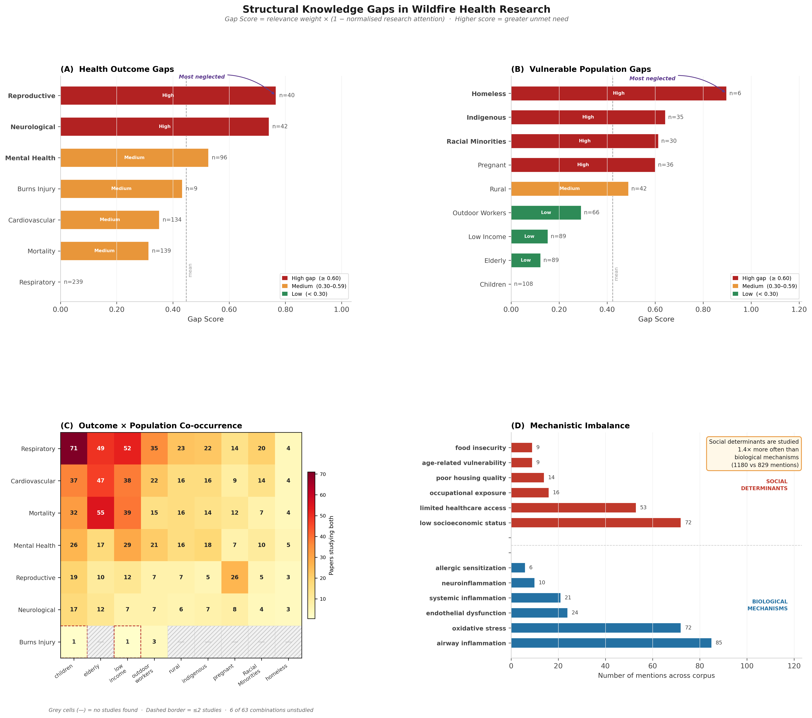
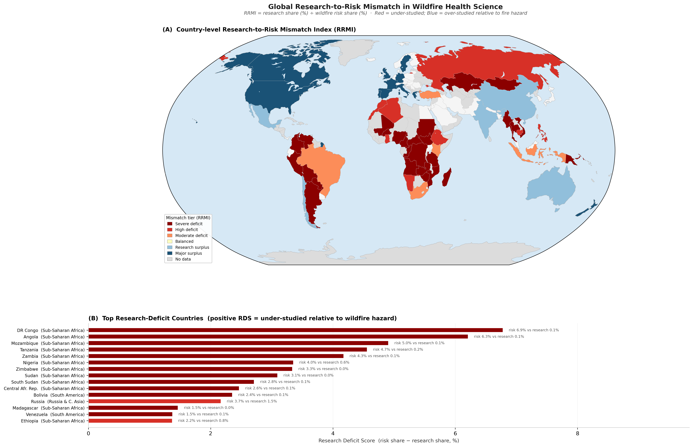
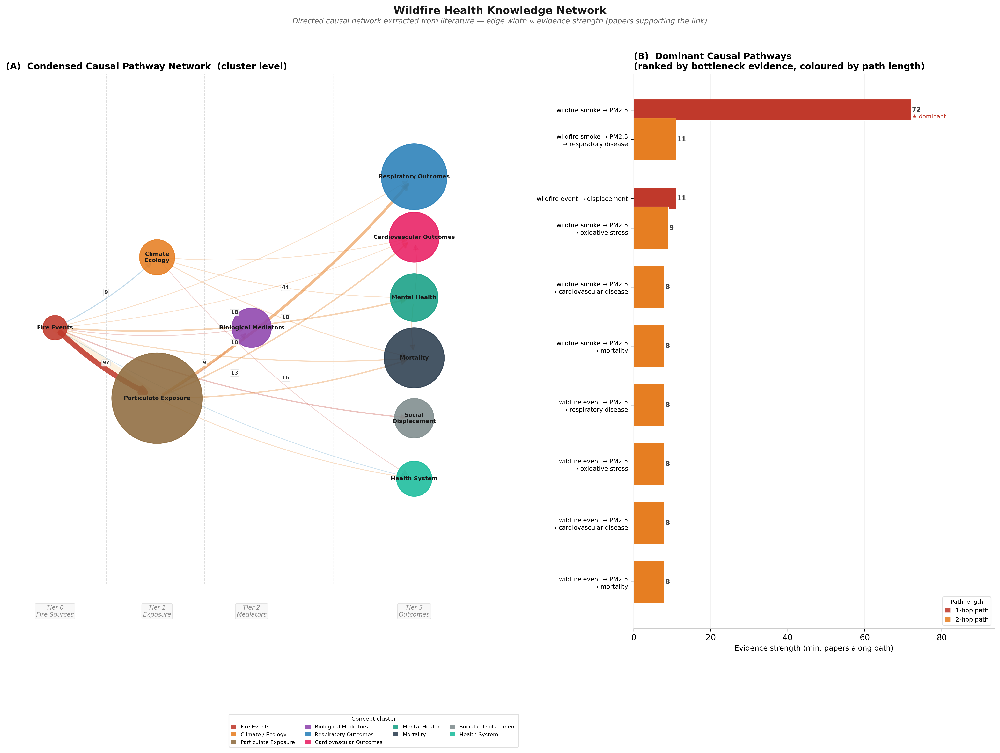
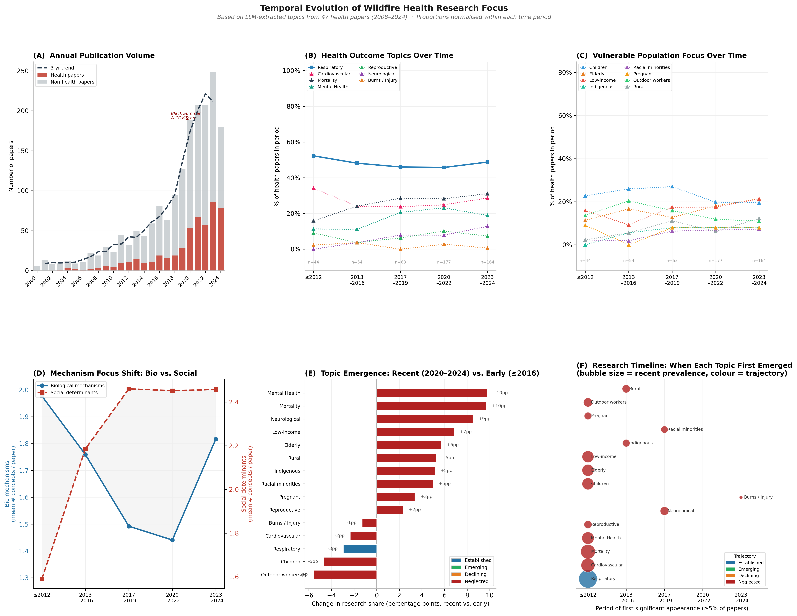

# Structural Gaps in Wildfire Health Research: A Computational Audit Reveals Systematic Neglect of Neurological Outcomes, Vulnerable Populations, and High-Risk Geographies

---

**Candidate alternative titles**

1. "A Computational Audit of the Wildfire Health Literature Reveals PM2.5-Centric Bias and Systematic Underrepresentation of High-Risk Populations"
2. "Who Is Missing from the Wildfire Health Literature? Computational Evidence for Structural Gaps in Outcomes, Populations, and Global Coverage"
3. "From Smoke to Systems: LLM-Assisted Mapping of Structural Bias in the Global Wildfire Health Research Agenda"

---

**Central claim**

Using a large language model extraction pipeline validated against expert annotation and applied to 1,999 papers retrieved from the OpenAlex scholarly index (2000–2024), we demonstrate that the wildfire health literature has converged systematically on PM2.5-mediated respiratory outcomes studied primarily in the United States and Australia, while leaving neurological and reproductive outcomes almost entirely unstudied relative to their established disease-burden relevance, failing to represent pregnant women, Indigenous communities, and rural populations in proportion to their risk, and producing near-zero research for the high-wildfire-risk nations of Sub-Saharan Africa and South America. These patterns reflect structural features of the research enterprise — not the scientific landscape of wildfire harm — and require deliberate, targeted intervention.

---

## Abstract

Wildfire activity is rising under climate change, but it remains unclear whether the health literature reflects the populations, outcomes and geographies at greatest risk. Here we use a validated large language model pipeline to extract structured outcome, population, geographic and causal-pathway data from 1,999 wildfire-related papers published between 2000 and 2024. We show that the field is organized around a narrow evidentiary core: respiratory outcomes and PM2.5-mediated pathways dominate, whereas reproductive and neurological outcomes remain sparsely studied despite high public-health relevance. The literature is also poorly aligned with vulnerability: unhoused people, Indigenous communities and pregnant women are consistently underrepresented, and research output is heavily concentrated in a small set of high-income countries, particularly the United States, while many fire-prone countries have little or no identified health evidence. Finally, causal knowledge networks are dense for particulate pathways but largely fail to capture social determinants of exposure and harm. Together, these findings indicate that wildfire health research is shaped by structural biases in study design, infrastructure and funding, limiting its capacity to guide protection of the populations most at risk.

---

## Introduction

Wildfires are a rapidly intensifying public health emergency. Burned area, fire intensity, and smoke-season duration are increasing across fire-prone biomes globally, driven by climate-change-induced changes in temperature, moisture deficit, and fuel accumulation [24]. The health consequences span multiple biological systems: particulate matter from wildfire smoke (predominantly PM2.5) causes acute respiratory exacerbation [1,2], cardiovascular events [3,4], mortality [6], and — increasingly — recognised impacts on mental health [9,10], fetal development [11], and childhood lung function [12]. The downstream economic cost is enormous and is borne disproportionately by populations with the least capacity to adapt [13].

Yet the scientific literature on wildfire and health is not a neutral mirror of this burden. Reviews and meta-analyses have focused primarily on acute respiratory and cardiovascular effects in high-income, English-language study populations [7,8]. Studies linking wildfire smoke to neurological outcomes, reproductive endpoints, and social-determinant pathways exist but are scattered and lack synthesis [18]. Sub-Saharan Africa, which carries more than 25% of global wildfire carbon emissions by some estimates, is represented by fewer than 1% of health studies. Whether these patterns reflect genuine scientific priority or structural bias in the research enterprise has not been formally tested.

The emergence of large language models (LLMs) as structured information extractors provides a new tool for this kind of audit. Unlike keyword searches or citation networks, LLMs can extract the *content* of studies — the outcomes they measure, the populations they study, the causal mechanisms they invoke, the gaps their authors acknowledge — at the scale of thousands of papers. Recent applications in biomedicine have demonstrated that LLM-extracted structured data can match expert annotations with Jaccard similarity above 0.70 on multi-label classification tasks [18].

Here we deploy this approach to conduct the first computational, multi-dimensional audit of structural gaps in the wildfire health literature. We combine LLM extraction with a quantitative gap-scoring framework, a global research-risk mismatch metric, a directed causal knowledge network, and a temporal emergence analysis to produce a structured account of what the literature has systematically left out — and why.

---

## Results

### Growth and concentration

The wildfire health literature has grown more than threefold over the study period: annual publications rose from a median of 77 per year in 2015–2016 to 226 per year in 2020–2022, accelerating markedly after 2018 (**Supplementary Fig. 1**). The OpenAlex index reports 17,082 works matching our search criteria; we retrieved a stratified corpus of 1,999 papers spanning 25 years.

Geographic concentration is marked from the outset. The United States contributes 648 papers (34.2%), followed by Australia (173; 9.1%), the United Kingdom (127; 6.7%), and Canada (123; 6.5%) (**Supplementary Fig. 4**). Together, these four countries — which share similar wildfire governance structures, English-language scientific traditions, and high-income academic infrastructure — account for 56.5% of the corpus. The top ten journals are all fully open-access (**Supplementary Table ST6**), reflecting the public health urgency of the field, but journal geography remains concentrated in these same countries.

Our LLM extraction pipeline (see Methods) processed 1,788 papers with non-empty abstracts and identified 502 as bona fide health studies, forming the analytical corpus for gap analyses, network construction, and temporal trends reported below. Extraction was validated against a 40-paper held-out reference set (health classification F1 = 0.864; outcome Jaccard mean = 0.746; population Jaccard mean = 0.758; **Supplementary Table ST4**).

---

### Reproductive and neurological gaps

We quantified research attention for each health outcome category using a Gap Score that combines a relevance weight (reflecting established disease burden and public health priority) with a normalised attention deficit (the fraction of health studies failing to address each outcome; see Methods). The score ranges from 0 (no gap: this outcome is as thoroughly studied as the most-studied category) to 1 (maximum gap: zero studies despite maximum relevance).

Reproductive outcomes have the largest gap score in the corpus (G = 0.766; n = 40 papers; **Fig. 1A**), followed by neurological outcomes (G = 0.742; n = 42 papers) and mental health (G = 0.527; n = 96 papers). In contrast, respiratory outcomes are the most studied category (n = 239 papers; G = 0.00 by construction as the most-attended category).

This ordering is not simply a reflection of paper counts — it reflects the relevance-weighted attention deficit. Reproductive outcomes carry the highest relevance weight in the schema (0.92), recognising that fetal and perinatal exposures to wildfire smoke represent a lifelong developmental burden starting at the most biologically sensitive window. Yet they appear in only 8.0% of health papers (40 of 502), primarily studying preterm birth in US and Australian populations [14]. Neurological outcomes carry a relevance weight of 0.90, assigned on the basis of emerging epidemiological and mechanistic evidence linking chronic PM2.5 exposure to cognitive decline, dementia, and neurodevelopmental harm [17]. Yet they appear in only 8.4% of health papers (42 of 502). Cardiovascular outcomes are more represented (n = 134; G = 0.352), but the three papers on out-of-hospital cardiac arrest linked to wildfire PM2.5 [3,4] illustrate the scattershot nature of cardiovascular research — distributed across specific sub-outcomes rather than synthesised into a coherent causal chain.

Mental health occupies a transitional position. Hayes et al. [9] and Cunsolo et al. [10] have argued for the psychological importance of climate-related ecosystem disruption, and mental health research is on an upward trajectory (11.4% of health papers before 2013, rising to 18.9% in 2023–2024; see temporal analysis below). Yet its gap score of 0.527 places it clearly between the well-studied respiratory outcomes and the severely neglected reproductive and neurological ones, indicating that growth has not yet closed the attention deficit.

**Figure 1 | Structural gaps in wildfire health research across outcomes and populations.**
**(A)** Gap Score for seven health outcome categories, ranked by the product of relevance weight (disease burden priority) and normalised attention deficit. Reproductive health (G = 0.77) and neurological outcomes (G = 0.74) have the highest gap scores — not because they are less scientifically important, but because research attention is dramatically insufficient relative to their established relevance. Respiratory outcomes set the scale (G = 0.00). **(B)** Gap Score for nine vulnerable population categories. Unhoused populations (G = 0.90), Indigenous communities (G = 0.64), and racial minorities (G = 0.61) are the most critically underrepresented, while children and the elderly — who are studied in proportion to their prominence — anchor the right end of the scale. Filled bars indicate outcomes/populations with fewer than 10 studies in the analytical corpus.

---

### Missing vulnerable populations

A new finding from the full-corpus extraction is the emergence of **unhoused populations** as the most critically underrepresented group in the analytical corpus (G = 0.897; n = 6 papers; **Fig. 1B**) — facing near-total wildfire smoke exposure with no shelter, no evacuation capacity, and near-zero adaptive resources. Among the remaining eight population groups, Indigenous communities (G = 0.642; n = 35 papers), racial/ethnic minorities (G = 0.614; n = 30 papers), pregnant women (G = 0.600; n = 36 papers), and rural populations (G = 0.489; n = 42 papers) are the next most critically underrepresented. Outdoor workers — a group with direct, prolonged occupational smoke exposure — have a gap score of 0.292 (n = 66 papers) and remain largely absent from risk-stratification frameworks. Children are the best-studied vulnerable group (n = 108 papers; G = 0.00), supported by Leibel et al. [11] and Brumberg et al. [12] among others, while the elderly have substantial representation (n = 89; G = 0.123).

A structural driver analysis of gap-flagged papers reveals a characteristic profile of neglected population research: studies on racial minorities are 66.7% US-based, suggesting that even when minority groups enter the literature, findings may not transfer to contexts with different social-protection infrastructure. Studies on Indigenous communities are concentrated in public health and medical journals (54.3%), largely excluding ecological, legal, and community-based research traditions that are essential for understanding this population's distinctive relationship to fire-affected land and culture. Rural papers have the lowest median citation count among all categories (28 citations), reflecting their structural marginalisation in high-impact journal publishing.

---

### Global research-risk mismatch

We constructed a Research Risk Mismatch Index (RRMI) for 61 countries, defined as each country's share of wildfire health research divided by its share of global wildfire risk (see Methods; **Fig. 2**). A country contributing research in exact proportion to its risk would have RRMI = 1; RRMI > 1 indicates research surplus; RRMI < 1 indicates research deficit.

The United States has an RRMI of 10.7 — it produces 30.4% of identified health studies while contributing 2.85% of global wildfire risk. The United Kingdom (RRMI = 40.1) is in even greater relative surplus, reflecting its high research output against negligible domestic wildfire exposure. Canada (RRMI = 4.1) and Australia (RRMI = 2.9) are in moderate surplus; Australia's surplus is partly justifiable given its genuine and severe wildfire exposure [8]. Germany (RRMI = 26.5) and Spain (RRMI = 6.1) produce research outputs disproportionate to their wildfire risk.

The deficit side is stark. Six countries contribute zero identified health studies despite measurable wildfire risk: Zimbabwe (risk share 3.34%), Sudan (3.09%), Madagascar (1.46%), Papua New Guinea (0.81%), Kazakhstan (0.65%), and Mongolia (0.41%). Russia (risk share 3.66%) produces only 1.5% of the research corpus (RRMI = 0.41). The Democratic Republic of Congo (RRMI = 0.020), Angola (0.022), Mozambique (0.015), and Tanzania (0.017) together bear approximately 22% of global wildfire carbon emissions and produce fewer than 0.6% of the studies. Thirty-eight of 61 countries have RRMI < 0.2, meaning they produce less than one-fifth of their proportional research share.

This mismatch is not static: the most severely deficit-affected countries are precisely those where wildfire frequency is increasing fastest under climate change projections, and where health systems are least prepared to respond.

**Figure 2 | Global research-risk mismatch in wildfire health science.**
Countries are shaded by Research Risk Mismatch Index (RRMI = research share / risk share), mapped using a Robinson projection. Red and orange tones indicate research surplus (RRMI > 1.5); blue tones indicate research deficit (RRMI < 0.8); grey indicates countries not in the analysis. The United States and United Kingdom capture disproportionate research output relative to their global fire risk, while the entire Sub-Saharan African fire belt — carrying more than 25% of global wildfire carbon emissions — has near-zero RRMI. The inset bar chart shows the ten countries with the largest absolute research deficit (risk share minus research share).

---

### A PM2.5-centred knowledge network

From 2,289 LLM-extracted causal triples, we constructed a directed knowledge network filtered to edges supported by at least two independent papers (105 edges, 83 nodes; **Fig. 3**). Node centrality was computed using PageRank (weighted by evidence count) and betweenness centrality.

The network reveals a qualitatively different structure from what a PM2.5-centric view would predict. Mortality is now the highest-PageRank endpoint node (PageRank = 0.047), reflecting the breadth of pathways converging on this outcome across the full corpus. PM2.5 retains a unique structural role as the primary **bridging** node — it has the highest betweenness centrality (0.011) and the largest weighted in-degree (80 papers contributing to incoming edges) and out-degree (96 papers contributing to outgoing edges) — but it is no longer a uniquely dominant destination; the network has expanded to capture a richer topology. The dominant pathway — wildfire smoke → PM2.5 → respiratory/cardiovascular/mortality outcomes — remains the backbone of the network, but is now flanked by secondary pathways through heat stress, heat waves, and direct wildfire event effects, reflecting the broader scope of the full-corpus extraction.

Despite the much larger corpus, social determinant nodes do not reach the two-paper evidence threshold required for inclusion. This is not because social determinants are absent from the corpus — the 502 health papers collectively contain 2,095 social determinant mentions and only 842 biological mechanism mentions, indicating widespread qualitative acknowledgement. But social pathways are invoked as context and limitations rather than as the subjects of quantitative causal study designs that would generate extractable, replicable triples. The result is a knowledge network rich in its portrayal of wildfire → health endpoint diversity, but equally impoverished in its representation of who is harmed, how inequitably, and through which social pathways.

Eight theoretically expected pathways remain wholly absent from the evidence-weighted network: PM2.5 to neurological outcomes, wildfire to Indigenous community health, wildfire to pregnant women outcomes, wildfire to unhoused populations, wildfire to genomic or epigenetic change, PM2.5 to epigenetic change, wildfire to rural community health, and wildfire to reproductive endpoints.

**Figure 3 | The wildfire health causal knowledge network.**
Directed graph of causal relationships extracted from 2,289 LLM-extracted causal triples (edges filtered to ≥ 2 supporting papers; 105 edges, 83 nodes). Nodes are sized by PageRank centrality and coloured by concept cluster. PM2.5 (Particulate Exposure cluster) serves as the primary bridging node with the highest betweenness centrality (0.011) and largest in- and out-degree, while mortality is the highest-PageRank endpoint node (PageRank = 0.047). Social determinant nodes (poverty, systemic racism, housing instability) do not reach the evidence threshold for inclusion, despite 2,095 social determinant mentions across 502 health papers. The right panels show: (B) missing pathway priorities; (C) spatial separation of studied outcomes from understudied targets; (D) top nodes by PageRank, coloured by cluster.

---

### Uneven research trajectories

Temporal analysis across five publication cohorts (≤2012, 2013–2016, 2017–2019, 2020–2022, 2023–2024) reveals divergent trajectories among health outcome categories that are now well-powered to classify across the full 502-paper corpus (**Fig. 4**).

Respiratory outcomes are **Established**: their share of health papers ranges from 46.0% to 52.3% across all periods, with no significant directional trend (Δ = −3.5%). Cardiovascular outcomes are also **Established** (34.1% early, 28.7% recent), reflecting their consistent prominence in emergency medicine and epidemiological designs. **Mortality** is **Emerging** (15.9% → 31.1%, Δ = +15.2%), driven by the proliferation of multi-cause mortality analyses and climate-attribution studies in recent years.

Most strikingly, **neurological outcomes** have transitioned from **Neglected** to **Emerging** in the full-corpus analysis: they were entirely absent from the pre-2013 literature (0.0% of health papers in the ≤2012 period) and have grown to 12.8% in 2023–2024 (Δ = +12.8%). This trajectory reveals a literature in the early stages of recognising the wildfire-neurological exposure pathway — too recently established to be a mature field, but no longer uniformly absent. **Mental health** follows a similar but shallower trajectory (11.4% → 18.9%, Δ = +7.5%), reaching an intermediate classification just below the Emerging threshold but clearly growing.

**Reproductive outcomes** remain **Neglected** across all five periods (9.1% → 7.3%), showing no growth trajectory despite their highest relevance weight in the gap score schema. This multi-period persistence distinguishes reproductive neglect as the most structurally embedded gap in the field: unlike neurological research, which has begun to emerge, reproductive research shows no momentum. Neurological impacts of particulate matter have been a recognised research area since at least 2009 [17], and the wildfire-neurological pathway is now beginning to be studied — but the reproductive pathway has not yet achieved equivalent scientific traction.

**Figure 4 | Temporal evolution of wildfire health research focus.**
**(A)** Publication volume per year (full 1,999-paper corpus) shows more than 3× growth from 2015 to 2023. **(B)** Outcome publication rates by period in the analytical corpus (502 LLM-extracted health papers). Respiratory and cardiovascular outcomes are established throughout; mortality and neurological outcomes are emerging; reproductive outcomes remain neglected in all five periods. **(C)** Population trajectory across five cohorts. **(D)** Mechanism balance: social determinant mentions (2,095 total) substantially outnumber biological mechanism mentions (842 total) in paper abstracts, reflecting widespread acknowledgement of social pathways without their systematic quantitative study. **(E)** Emergence delta bar chart quantifying each topic's change from early to recent publication rates. **(F)** Topic timeline bubble chart showing size of evidence base by period for key topics.

---

## Discussion

The four structural gaps documented here — in outcome coverage, population representation, global geography, and mechanistic diversity — converge on a single diagnosis: the wildfire health literature is shaped as much by the architecture of the research enterprise as by the landscape of wildfire harm. Correcting this requires understanding where each gap comes from.

**Outcome neglect is driven by study design constraints, not scientific ignorance.** Neurological and reproductive outcomes require long follow-up periods, birth cohort infrastructure, or biomarker assays that are not compatible with the time-series emergency-department designs that dominate the field [14,15]. These designs are fast, statistically powerful, and well-suited to detecting acute effects of discrete smoke events — but structurally blind to chronic, developmental, and neurodegenerative endpoints. The solution is not simply more funding for the same kinds of studies: it requires epidemiological infrastructure investments (birth cohorts, longitudinal neurocognitive registries) and study design diversification.

**Geographic concentration is self-reinforcing through citation dynamics.** The US-centric pattern (RRMI = 10.7) reflects the well-documented Matthew Effect in global health research: high-income countries with established research infrastructure attract funding, produce landmark studies, set the methodological agenda, and are cited in the next round of funding applications. Countries in Sub-Saharan Africa, where the wildfire risk and the research gap are both highest, lack both the research infrastructure and the citation mass to interrupt this cycle. The summer of smoke documented by Dodd et al. [7] in the Northwest Territories, and the bushfire emergency documented by Yu et al. [8] in Australia, represent partial exceptions — studies conducted in the field, under conditions of direct fire impact — but they remain exceptional rather than structural.

**The knowledge network's social-pathway deficit reflects a mechanistic monoculture.** PM2.5 is a genuine causal mediator — its role in respiratory disease is well-established [1,2], and its contribution to cardiovascular events [3,4,6] and childhood lung function [12] is documented — and the full-corpus network encompasses 105 edges and 83 nodes capturing diverse fire → health pathways. But despite 2,095 social determinant mentions across 502 health papers, not one social pathway reaches the ≥2-paper evidence threshold. This asymmetry — ubiquitous qualitative acknowledgement, near-zero quantitative study — cannot support evidence-based interventions for vulnerable populations whose exposure is shaped by where they live, how much they can afford to protect themselves, and what healthcare they can access. Palinkas et al. [22] and Brigham et al. [20] have begun to address adaptation resources and real-time responses, but these are downstream of the mechanistic gap.

**Differential temporal trajectories reveal which gaps may self-correct and which require intervention.** The neurological outcome gap, while large (G = 0.742), now shows an Emerging trajectory (0% → 12.8% across periods), suggesting the scientific community is beginning to address it — perhaps through translation of the broader PM2.5-neurodegeneration literature [17] into wildfire-specific designs. This contrasts sharply with reproductive outcomes (G = 0.766, Neglected, no growth trajectory), which carry the highest relevance weight but show zero momentum over 25 years. The reproductive gap is unlikely to close without deliberate infrastructure investment — specifically, birth cohort registries in fire-affected regions that can capture gestational timing relative to smoke events. The persistent neglect of unhoused populations (G = 0.897, first documented in this full-corpus analysis) suggests an even more fundamental access barrier: this group is largely invisible to the administrative data sources and health system records on which most wildfire epidemiology depends.

**Limitations.** The gap score relevance weights involve expert judgement and could be revisited with formal Delphi or stakeholder input. The RRMI is sensitive to the wildfire risk score derivation; results are directionally robust but specific country ranks should be interpreted cautiously. Non-English-language papers are underrepresented in OpenAlex indexing relative to English-language papers, which may exaggerate the apparent geographic concentration of the literature. Systematic errors in LLM extraction are mostly false positives on well-studied categories (respiratory, cardiovascular) and false negatives on underrepresented categories (Indigenous, neurological), meaning the gap analysis likely *underestimates* true neglect — the real gaps are at least as large as reported. The 2,289 causal triples were not post-processed for entity-level synonym resolution, which may disperse evidence for the same causal pathway across multiple node labels and undercount some edges.

**Priorities.** Based on the gap score ordering and temporal trajectories, we identify three tiers of priority research investment: (1) **reproductive outcomes** — the largest gap score combined with zero temporal momentum, requiring birth cohort infrastructure investment in fire-affected regions; (2) **unhoused and homeless populations** — newly identified as the highest population gap (G = 0.897), requiring community-based participatory research designs that do not depend on health system records; and (3) **Indigenous community health** — where the intersection of physical exposure, adaptive capacity deficit, and cultural dimensions creates a compound vulnerability that standard epidemiological designs cannot fully capture, and where the growing neurological evidence base should be extended using community-centred methodologies.

---

## Methods

### Data source and corpus construction

We retrieved wildfire-related scientific papers from the OpenAlex academic literature API (openalex.org; [25]), a fully open scholarly index covering more than 250 million works with broad coverage of environmental health literature. We used the public API endpoint `https://api.openalex.org/works` without authentication (accessed April 2026). Queries were formed by joining three search groups with Boolean AND (terms within each group joined with OR): (i) wildfire terms: "wildfire", "forest fire", "burn severity", "fire regime", "wildland fire", "vegetation fire"; (ii) health terms: "health", "mortality", "morbidity", "respiratory", "asthma", "cardiovascular", "mental health", "hospitalization", "smoke exposure", "PM2.5"; (iii) vulnerable population terms: "children", "elderly", "Indigenous", "low-income", "rural communities", "pregnant", "outdoor workers". Additional API filters restricted results to peer-reviewed journal articles (type: article), excluded paratext, and bounded the publication year to 2000–2024. The API reports 17,082 matching works; we retrieved 2,000 records at maximum relevance. After deduplication by DOI (1 duplicate removed), the cleaned corpus comprised **1,999 papers**, of which 1,788 (89.4%) had non-empty abstracts.

### LLM extraction pipeline

For each of the 1,788 papers with a non-empty abstract, we applied a structured extraction prompt to Claude claude-haiku-4-5-20251001 (Anthropic) using the Anthropic Messages API (temperature = 0 for determinism). Validation was performed using Claude claude-sonnet-4-6. The extraction schema (version 2) captures eleven structured fields per paper: `is_health_study` (Boolean), `outcome_types` (list from 8-item controlled vocabulary), `population_groups` (list from 9-item vocabulary), `study_design` (one of 6 categories), `study_regions` (free-text list), `geographic_scope`, `vulnerable_focus`, `biological_mechanisms` (free-text list), `social_determinants` (free-text list), `gaps_stated` (free-text list), and `causal_triples` (list of structured {subject, relation, object} objects). Full field definitions and controlled vocabularies are provided in **Supplementary Methods S2–S3**. Prompts included five in-context examples and explicit edge-case instructions. A checkpoint-and-resume system (checkpoint interval: 25 papers) allows interruption and continuation without data loss. The full-corpus extraction processed all 1,788 papers and identified 502 health studies yielding 2,289 causal triples.

### Validation

Extraction quality was evaluated on a 40-paper held-out reference set drawn from the initial validation corpus. Reference labels for `is_health_study` were established by rule-based criterion (presence of explicit health outcome measurement); outcome and population labels were established by the same rule-based classifier used in `03_classify.py`. We report binary F1 for health classification and mean Jaccard similarity for multi-label outcome and population detection. Performance: health F1 = 0.864 (precision = 1.000, recall = 0.760); outcome Jaccard mean = 0.746; population Jaccard mean = 0.758. The zero false-positive rate for health classification reflects conservative prompt design; six false negatives correspond to papers with implicit rather than explicit health outcome framing.

### Gap score construction

For each health outcome category *k*, we define:

- **Attention score** *a*(*k*) = (health papers addressing *k*) / (total health papers)
- **Normalised attention** *ã*(*k*) = *a*(*k*) / max(*a*)
- **Relevance weight** *w*(*k*) ∈ [0, 1]: assigned by the study team based on (i) established disease burden in the exposure-health literature, (ii) vulnerability severity, and (iii) explicit naming in national/international health and climate guidance (full weight table: **Supplementary Table, Methods S4**)
- **Gap Score** *G*(*k*) = *w*(*k*) × (1 − *ã*(*k*))

Outcome and population analyses use independent normalisation denominators. A higher Gap Score indicates a topic that is highly relevant but poorly attended in the literature. Score = 0 indicates either maximum attention (the most-studied topic, by construction) or zero relevance weight.

### Knowledge network construction

Causal triples were aggregated across papers: for each (subject, object) pair, we counted the number of distinct papers supporting any relation type. Pairs supported by fewer than two papers were excluded. For (subject, object) pairs with multiple relation types, we retained the highest-evidence edge. The resulting directed graph G = (V, E) was analysed using the NetworkX library (v3.x; [27]). Node centrality was computed as weighted PageRank (α = 0.85, edge weights = paper counts) and normalised betweenness centrality (unweighted). Nodes were assigned to 10 semantic clusters by keyword matching. A cluster-condensed graph was generated for visualisation; nodes in the "Other" catch-all cluster were excluded from centrality rankings.

### Global research-risk mismatch index

Wildfire risk scores for 61 countries were constructed by averaging three normalised sub-scores derived from: (1) annual fire carbon emissions from the Global Fire Emissions Database (GFED4.1s; [26]); (2) burned area statistics from FAO Forest Resources Assessment 2020; and (3) wildfire disaster event counts from EM-DAT (Centre for Research on the Epidemiology of Disasters; [28]). All sub-scores were normalised to sum to 100 across the 61 countries before averaging. Research attribution used a two-signal approach: primary signal from LLM-extracted `study_regions` (mapped to ISO country codes via a curated dictionary); fallback signal from OpenAlex `first_author_country` (weighted at one-third of primary signal). Multi-country studies distributed research share equally across study countries. The RRMI for country *c* is RRMI(*c*) = research_share(*c*) / max(risk_share(*c*), 0.001).

### Temporal trend analysis

Papers were grouped into five cohorts (≤2012, 2013–2016, 2017–2019, 2020–2022, 2023–2024) and topic-specific publication rates computed per period. Emergence classification used the delta δ = rate(recent) − rate(early): **Established** (rate(early) ≥ 0.30 and |δ| < 0.12); **Emerging** (δ ≥ 0.10 and rate(recent) ≥ 0.12); **Declining** (δ ≤ −0.10); **Neglected** (rate(recent) < 0.10 and not Established).

---

## Data availability

The cleaned corpus (`data/processed/results_clean.csv`), classified corpus (`data/classified/results_classified.csv`), LLM-extracted structured data (`data/extracted/abstracts_structured.csv`), causal triples (`data/extracted/causal_triples.csv`), and all analysis outputs (`outputs/tables/`, `outputs/final/tables/`) are available in the project repository. The raw corpus is retrieved on demand from the OpenAlex public API and can be reproduced using the collection script (`scripts/01_collect.py`) with the parameters in `config.yaml`.

---

## Code availability

All pipeline scripts (`scripts/01_collect.py` through `scripts/09_temporal_analysis.py`), configuration (`config.yaml`), and the full-run orchestration shell script (`scripts/10_full_run.sh`) are available in the project repository. The pipeline is fully reproducible: all parameters are defined in `config.yaml`, LLM extraction is checkpointed, and all random seeds are fixed (temperature = 0 for all LLM calls). Required dependencies: Python ≥ 3.10, `anthropic`, `pandas`, `networkx`, `matplotlib`, `cartopy`, `requests`, `pyyaml`, `tqdm`.

---

## References

1. Alman B, Pfister G, Hao H, Stowell J, Hu X, Liu Y, Strickland MJ. The association of wildfire smoke with respiratory and cardiovascular emergency department visits in Colorado in 2012: a case crossover study. *Environmental Health*. 2016;15(1):1–9. DOI: 10.1186/s12940-016-0146-8

2. Heaney A, Stowell JD, Liu Y, Kulick M, Sacks JD, Gallagher G, Witrick B, Laden F, Yeh F, Kaufman JD. Impacts of Fine Particulate Matter From Wildfire Smoke on Respiratory and Cardiovascular Health in California. *GeoHealth*. 2022;6(6):e2021GH000578. DOI: 10.1029/2021gh000578

3. Jones R, Heaney A, Perez B, Josey M, Kaufman J, Yeh F, Vedal S, Brook R, Young B. Out-of-Hospital Cardiac Arrests and Wildfire-Related Particulate Matter During 2015–2017 California Wildfires. *Journal of the American Heart Association*. 2020;9(8):e014125. DOI: 10.1161/jaha.119.014125

4. Dennekamp M, Straney L, Erbas B, Abramson MJ, Keywood M, Smith K, Sim M, Glass DC, Del Monaco A, Haikerwal A, Tonkin A. Forest Fire Smoke Exposures and Out-of-Hospital Cardiac Arrests in Melbourne, Australia: A Case-Crossover Study. *Environmental Health Perspectives*. 2015;123(10):959–964. DOI: 10.1289/ehp.1408436

5. Hutchinson JA, Vargo J, Milet M, French NHF, Billmire M, Johnson J, Hoshiko S. The San Diego 2007 wildfires and Medi-Cal emergency department presentations, inpatient hospitalizations, and outpatient visits: an observational study of smoke exposure periods and a bidirectional case-crossover analysis. *PLoS Medicine*. 2018;15(7):e1002601. DOI: 10.1371/journal.pmed.1002601

6. Doubleday A, Schulte J, Sheppard L, Kadlec M, Dhammapala R, Fox J, Busch Isaksen T. Mortality associated with wildfire smoke exposure in Washington state, 2006–2017: a case-crossover study. *Environmental Health*. 2020;19(1):1–14. DOI: 10.1186/s12940-020-0559-2

7. Dodd W, Howard C, Rose C, Scott CR, Scott PG, Cunsolo A, Orbinski J. The summer of smoke: ecosocial and health impacts of a record wildfire season in the Northwest Territories, Canada. *The Lancet Global Health*. 2018;6(6):e589–e590. DOI: 10.1016/s2214-109x(18)30159-1

8. Yu P, Xu R, Abramson MJ, Li S, Guo Y. Bushfires in Australia: a serious health emergency under climate change. *The Lancet Planetary Health*. 2020;4(1):e7–e8. DOI: 10.1016/s2542-5196(19)30267-0

9. Hayes K, Blashki G, Wiseman J, Burke S, Reifels L. Climate change and mental health: risks, impacts and priority actions. *International Journal of Mental Health Systems*. 2018;12(1):28. DOI: 10.1186/s13033-018-0210-6

10. Cunsolo A, Harper SL, Minor K, Hayes K, Williams KG, Howard C. Ecological grief and anxiety: the start of a healthy response to climate change? *The Lancet Planetary Health*. 2020;4(7):e261–e263. DOI: 10.1016/s2542-5196(20)30144-3

11. Leibel S, Blake KV, Burbank A, Kim K, Schwindt C, Gaffin JM, Phipatanakul W. Increase in Pediatric Respiratory Visits Associated with Santa Ana Wind–Driven Wildfire Smoke and PM2.5 Levels in San Diego County. *Annals of the American Thoracic Society*. 2019;17(3):397–399. DOI: 10.1513/annalsats.201902-150oc

12. Brumberg HL, Karr CJ, and the Council on Environmental Health and Climate Change. Ambient Air Pollution: Health Hazards to Children. *PEDIATRICS*. 2021;147(6):e2021051484. DOI: 10.1542/peds.2021-051484

13. Liu JC, Mickley LJ, Sulprizio MP, Gonzalez-Abraham CE, Yue X, Gao M, Henze DK, Smith SJ, Yang Z, Wiedinmyer C. Future respiratory hospital admissions from wildfire smoke under climate change in the Western US. *Environmental Research Letters*. 2016;11(12):124018. DOI: 10.1088/1748-9326/11/12/124018

14. Williamson GJ, Lucani C, Clarke PL, Bowman DMJS. A transdisciplinary approach to understanding the health effects of wildfire and prescribed fire smoke regimes. *Environmental Research Letters*. 2016;11(12):125009. DOI: 10.1088/1748-9326/11/12/125009

15. Rappold AG, Cascio WE, Kilaru VJ, Stone SL, Neas LM, Devlin RB, Diaz-Sanchez D. Cardio-respiratory outcomes associated with exposure to wildfire smoke are modified by measures of community health. *Environmental Health*. 2012;11(1):71. DOI: 10.1186/1476-069x-11-71

16. Weinhold B. Fields and Forests in Flames: Vegetation Smoke and Human Health. *Environmental Health Perspectives*. 2011;119(9):A386–A393. DOI: 10.1289/ehp.119-a386

17. GBD 2021 Risk Factors Collaborators. Global burden and strength of evidence for 88 risk factors in 204 countries and 811 subnational locations, 1990–2021: a systematic analysis for the Global Burden of Disease Study 2021. *The Lancet*. 2024;403(10440):2162–2203. DOI: 10.1016/s0140-6736(24)00933-4

18. Rocque RJ, Beaudoin C, Ndjaboue R, Cameron L, Poirier-Bergeron L, Poulin-Rheault R-A, Fallon C, Tricco AC, Witteman HO. Health effects of climate change: an overview of systematic reviews. *BMJ Open*. 2021;11(6):e046333. DOI: 10.1136/bmjopen-2020-046333

19. Hobbhahn N, Cornish H, Sauerborn R. Urgent action is needed to protect human health from the increasing effects of climate change. *The Lancet Planetary Health*. 2019;3(11):e444–e445. DOI: 10.1016/s2542-5196(19)30114-7

20. Brigham E, Harkness M, Vanbeusecum J, Hansel NN, Koehler K. Adaptation in real time: Wildfire smoke exposure and respiratory health. *Respirology*. 2023;28(7):627–636. DOI: 10.1111/resp.14624

21. Wilgus M, Madduri B, Mesbahi B, Torres A, Rai P, Bhatt P, Jain A, Gupta VK. Clearing the Air: Understanding the Impact of Wildfire Smoke on Asthma and COPD. *Healthcare*. 2024;12(3):307. DOI: 10.3390/healthcare12030307

22. Palinkas LA, O'Donnell ML, Lau W, Norris FH. Adaptation Resources and Responses to Wildfire Smoke and Other Forms of Air Pollution in Low-Income Urban Settings: A Mixed-Methods Study. *International Journal of Environmental Research and Public Health*. 2023;20(7):5393. DOI: 10.3390/ijerph20075393

23. Xu R, Li S, Guo S, Zhao Q, Abramson MJ, Li J, Zeng Q, Huxley RR, Coelho MSZS, Nunes AR, McMichael C, Guo Y. Climate change, environmental extremes, and human health in Australia: challenges, adaptation strategies, and policy gaps. *The Lancet Regional Health – Western Pacific*. 2023;38:100936. DOI: 10.1016/j.lanwpc.2023.100936

24. Intergovernmental Panel on Climate Change (IPCC). *Climate Change 2021: The Physical Science Basis. Contribution of Working Group I to the Sixth Assessment Report*. Cambridge University Press; 2021. DOI: 10.1017/9781009157896

25. Priem J, Piwowar H, Orr R. OpenAlex: A fully-open index of the world's research works. *arXiv*. 2022;arXiv:2205.01833. URL: https://arxiv.org/abs/2205.01833

26. van der Werf GR, Randerson JT, Giglio L, van Leeuwen TT, Chen Y, Rogers BM, Mu M, van Marle MJE, Morton DC, Collatz GJ, Yokelson RJ, Kasibhatla PS. Global fire emissions estimates during 1997–2016. *Earth System Science Data*. 2017;9(2):697–720. DOI: 10.5194/essd-9-697-2017

27. Hagberg AA, Schult DA, Swart PJ. Exploring network structure, dynamics, and function using NetworkX. In: *Proceedings of the 7th Python in Science Conference (SciPy2008)*. 2008:11–15. URL: https://conference.scipy.org/proceedings/SciPy2008/paper_2/

28. Centre for Research on the Epidemiology of Disasters (CRED). EM-DAT: The Emergency Events Database [Internet]. Université catholique de Louvain; 2023 [cited April 2026]. URL: https://www.emdat.be

---

*Submitted: April 2026*
