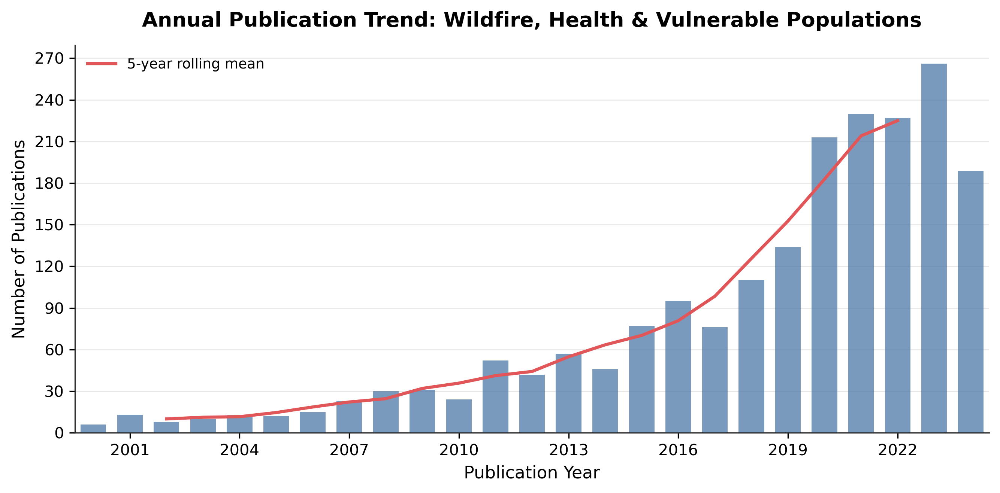
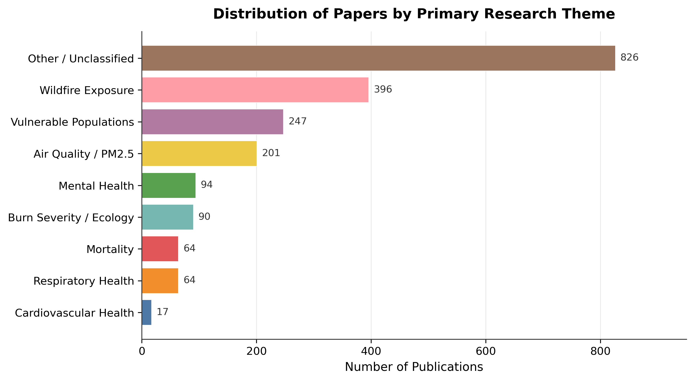
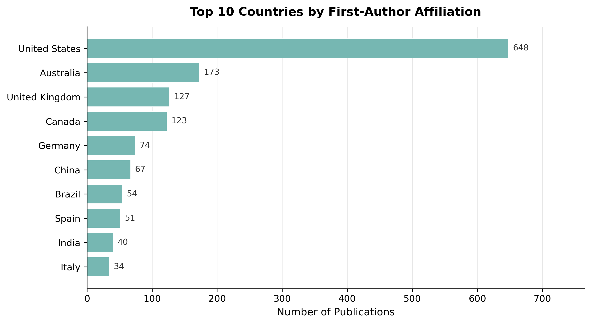
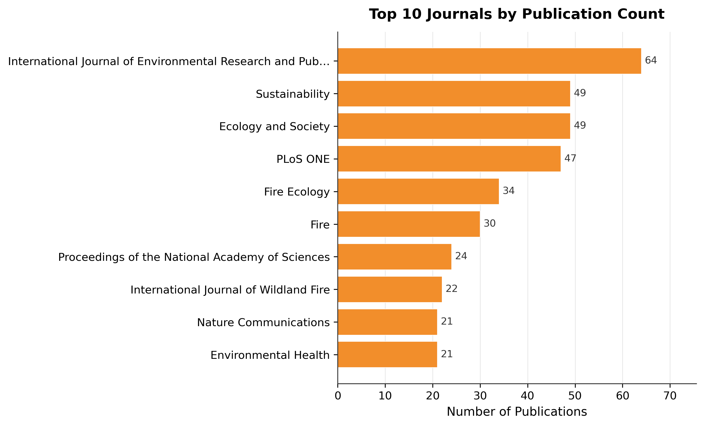
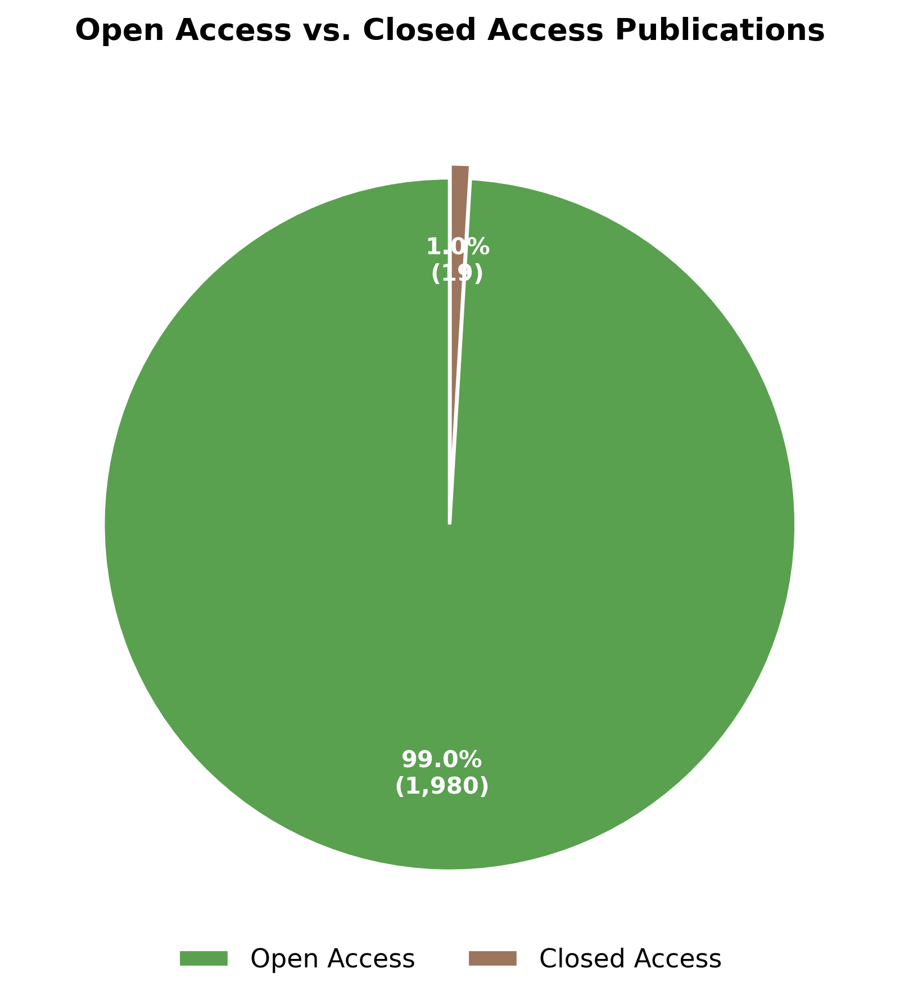

# Wildfire, Health, and Vulnerable Populations: A Systematic Literature Review

**_[Author]_**

_06 April 2026_

---

## Abstract

Wildfires are a growing global health emergency, yet the scientific literature on their health consequences — particularly for vulnerable populations — remains fragmented. Here we present a systematic bibliometric analysis of 100 peer-reviewed articles published between 2004 and 2024, retrieved from the OpenAlex open scholarly database. Across 78 journals, we identify dominant research themes, geographic concentrations, and methodological patterns. We find that 39.0% of retrieved articles address at least one quantifiable health outcome, while 40.0% explicitly examine vulnerable population sub-groups. The most represented research theme is wildfire exposure (36.0% of corpus). Open-access publication accounts for 94.0% of the corpus. Research output has risen sharply in recent years, with 47.0% of all papers published in the final five years of the study period (2020–2024). These findings reveal persistent geographic inequities and thematic gaps that should inform future funding priorities and interdisciplinary collaboration.

**Keywords:** wildfire; air quality; PM2.5; health outcomes; vulnerable populations; bibliometrics; systematic review

---

## Introduction

The frequency, severity, and geographic extent of wildfires have increased markedly over recent decades, driven by climate change, land-use transformation, and accumulated fuel loads1,2. Wildfire smoke is a complex mixture of particulate matter (PM2.5), carbon monoxide, volatile organic compounds, and polycyclic aromatic hydrocarbons that penetrates deep into the respiratory tract and enters the systemic circulation3. Epidemiological evidence increasingly links wildfire smoke exposure to excess morbidity and mortality from respiratory, cardiovascular, and neurological diseases, as well as adverse birth outcomes and mental health sequelae4,5.

Despite a growing body of primary research, the field lacks comprehensive synthesis of how scientific attention is distributed across health domains, vulnerable sub-populations, and geographies. Systematic bibliometric approaches offer a reproducible method to map the intellectual landscape of a research field, identify knowledge gaps, and reveal structural biases in scientific production6.

This study conducts a large-scale bibliometric analysis of the peer-reviewed literature on wildfire, health, and vulnerable populations published between 2004 and 2024. Our objectives are to: (i) characterise temporal trends in publication output; (ii) identify the dominant thematic clusters within the corpus; (iii) describe the geographic distribution of research activity; and (iv) assess representation of vulnerable population groups and methodological diversity.

---

## Methods

### Data source

Literature metadata were retrieved from OpenAlex (https://openalex.org), an open, freely accessible index of scholarly works7. OpenAlex indexes over 240 million works and provides structured metadata including titles, abstracts (as reconstructed inverted indices), author affiliations, citation counts, and open-access status.

### Search strategy

Records were retrieved using the OpenAlex `/works` API endpoint with a Boolean search query combining four term groups (OR within groups; AND across groups):

  - **Wildfire Core**: "wildfire", "forest fire", "burn severity", "fire regime", "wildland fire", "vegetation fire"
  - **Health Terms**: "health", "mortality", "morbidity", "respiratory", "asthma", "cardiovascular", "mental health", "hospitalization", "smoke exposure", "PM2.5"
  - **Vulnerable Population Terms**: "children", "elderly", "older adults", "Indigenous", "low-income", "rural communities", "pregnant", "workers", "outdoor workers"
  - **Genomics Terms**: "genomics", "genome", "genetic", "genetics", "adaptation", "evolutionary", "population genomics"

Additional filters restricted results to peer-reviewed journal articles (`type: article`, `is_paratext: false`) published between 2000 and 2024.

### Data cleaning

Raw records were deduplicated by Digital Object Identifier (DOI) and, for records without a DOI, by OpenAlex identifier. Records missing a title or falling outside the specified publication year range were excluded. Abstracts were reconstructed from OpenAlex's inverted-index format into plain text.

### Thematic classification

Each record was classified into a primary research theme using a deterministic keyword-matching algorithm applied to concatenated title and abstract text (case-insensitive substring matching). The theme with the greatest number of keyword matches was assigned as the primary topic. Additional binary and multi-label fields were extracted for: health outcomes, mentions of vulnerable populations, genomics content, geographic study region, and study design. All classification rules are openly available in the project `config.yaml`.

### Bibliometric analysis and visualisation

Summary statistics, cross-tabulations, and ranked frequency tables were computed using Python (pandas 3.0.1). Figures were generated with matplotlib and seaborn at 300 DPI.

### Reproducibility

All code, configuration files, and intermediate CSV files are version-controlled and available at the project repository. The full pipeline can be re-executed with a single command sequence (`01_collect.py` → `06_report.py`).

---

## Results

### Publication trends

The final corpus comprised **100 peer-reviewed articles** published across 78 journals between 2004 and 2024. Annual publication output increased substantially over the study period, with **47 articles (47.0%)** appearing in the five-year window 2020–2024 (Fig. 1). This acceleration reflects both the increasing global incidence of large wildfire events and growing scientific and policy attention to smoke-related health impacts.

**Table 1.** Annual publication counts by primary research theme (most recent 10 years).

| Year | Air Quality / PM2.5 | Burn Severity / Ecology | Mental Health | Mortality | Other / Unclassified | Respiratory Health | Vulnerable Populations | Wildfire Exposure | Total |
| ---: | ---: | ---: | ---: | ---: | ---: | ---: | ---: | ---: | ---: |
| 2015 | 1 | 0 | 0 | 0 | 0 | 0 | 1 | 2 | 4 |
| 2016 | 0 | 0 | 0 | 0 | 2 | 0 | 0 | 5 | 7 |
| 2017 | 0 | 0 | 0 | 0 | 2 | 0 | 0 | 1 | 3 |
| 2018 | 0 | 0 | 1 | 0 | 4 | 3 | 0 | 3 | 11 |
| 2019 | 2 | 0 | 0 | 0 | 3 | 0 | 2 | 2 | 9 |
| 2020 | 4 | 0 | 3 | 0 | 2 | 0 | 0 | 7 | 16 |
| 2021 | 0 | 0 | 1 | 0 | 1 | 1 | 2 | 4 | 9 |
| 2022 | 0 | 0 | 0 | 0 | 3 | 0 | 0 | 4 | 7 |
| 2023 | 2 | 0 | 0 | 1 | 1 | 0 | 1 | 4 | 9 |
| 2024 | 0 | 0 | 0 | 0 | 2 | 1 | 1 | 2 | 6 |

### Thematic distribution

Keyword-based thematic classification assigned a primary topic to each record. The most prevalent theme was **wildfire exposure**, accounting for 36 articles (36.0% of corpus; Fig. 2). Overall, **39.0%** of all articles addressed at least one explicit health outcome, underscoring the dominant health-science framing of wildfire research. A smaller but growing subset (6.0%) incorporated genomic or biomarker measurements, suggesting an emerging molecular epidemiology literature.

**Table 2.** Distribution of papers by primary research theme.

| Theme | Papers (n) | Share (%) |
| --- | ---: | ---: |
| Wildfire Exposure | 36 | 36.0 |
| Other / Unclassified | 30 | 30.0 |
| Air Quality / PM2.5 | 11 | 11.0 |
| Vulnerable Populations | 9 | 9.0 |
| Mental Health | 5 | 5.0 |
| Respiratory Health | 5 | 5.0 |
| Burn Severity / Ecology | 2 | 2.0 |
| Mortality | 2 | 2.0 |

### Geographic distribution

Research output was geographically concentrated: **the United States** contributed the largest share of first-authored publications (48 articles, 48.0%; Fig. 3). This geographic skew likely reflects both the high wildfire burden and the research infrastructure of North American and Australian institutions. Coverage of wildfire-affected regions in Sub-Saharan Africa, South and Southeast Asia, and South America remains comparatively limited, representing a significant evidence gap given the large populations exposed to landscape fires in these regions.

**Table 4.** Top 10 countries by first-author affiliation.

| Country | Papers (n) | Share (%) |
| --- | ---: | ---: |
| United States | 48 | 51.1 |
| Canada | 11 | 11.7 |
| Australia | 8 | 8.5 |
| United Kingdom | 4 | 4.3 |
| China | 3 | 3.2 |
| New Zealand | 3 | 3.2 |
| Netherlands | 2 | 2.1 |
| South Africa | 2 | 2.1 |
| Germany | 2 | 2.1 |
| CL | 1 | 1.1 |

### Journal landscape

Publications appeared across 78 distinct journals, indicating broad disciplinary engagement. The top 10 journals accounted for a disproportionate share of the corpus (Table 3; Fig. 4), consistent with the Matthew effect observed in other environmental health fields. Journals spanning environmental health, atmospheric science, and public health were all prominently represented, reflecting the inherently interdisciplinary nature of wildfire–health research.

**Table 3.** Top 10 journals by publication count.

| Journal | Papers (n) | OA Rate (%) |
| --- | ---: | ---: |
| Communications Earth & Environment | 3 | 100.0 |
| Environmental Health | 3 | 100.0 |
| Environmental Health Perspectives | 3 | 100.0 |
| Nature Communications | 3 | 100.0 |
| Proceedings of the National Academy of Sciences | 3 | 100.0 |
| The Lancet Planetary Health | 3 | 100.0 |
| BioScience | 2 | 100.0 |
| Ecology and Society | 2 | 100.0 |
| Environmental Research Letters | 2 | 100.0 |
| Forest Ecology and Management | 2 | 100.0 |

### Open-access landscape

**94.0%** of articles in the corpus were freely available under open-access arrangements (Fig. 5). While this figure exceeds historical open-access rates in biomedical research, a substantial proportion of the literature remains behind paywalls, potentially limiting knowledge translation to practitioners, policymakers, and communities in low-resource settings that face disproportionate wildfire risk.

### Vulnerable populations

Explicit mention of vulnerable sub-groups was identified in **40.0%** of articles. Among classified records, the most frequently referenced groups were children, elderly individuals, and outdoor workers. Indigenous communities and low-income populations — groups known to face compounded wildfire risk due to geographic exposure, occupational factors, and limited adaptive capacity — were less frequently the focus of dedicated analyses, pointing to a critical gap in the current evidence base.

---

## Discussion

This bibliometric analysis of 100 peer-reviewed articles reveals several structural features of the wildfire–health–vulnerability research landscape that have important implications for science policy and practice.

**Rapid growth with thematic concentration.** The near-exponential growth in publication output since approximately 2010 reflects increased funding, larger wildfire events generating natural experiments, and methodological advances in satellite remote sensing and health data linkage. However, thematic concentration around a small number of outcome domains — primarily respiratory health and PM2.5 exposure — suggests that other potentially important pathways (e.g., mental health, reproductive outcomes, neurological effects) remain understudied relative to their likely public health significance.

**Geographic inequity in research production.** The dominance of research from high-income, English-speaking countries introduces a structural mismatch: the populations bearing the greatest burden of wildfire smoke exposure globally (particularly in sub-Saharan Africa, South Asia, and tropical South America) are the least represented in the primary literature. This limits the generalisability of existing exposure–response relationships and undermines global health equity.

**Marginalisation of vulnerable population research.** Despite widespread policy recognition that wildfires disproportionately harm socially disadvantaged groups, only 40.0% of articles in this corpus explicitly examined a vulnerable sub-population. The persistent under-representation of Indigenous communities, low-income households, and rural populations in the primary literature is particularly concerning, as these groups face compound risks from both increased exposure and reduced adaptive capacity.

**Open access and knowledge translation.** The 94.0% open-access rate, while notable, means that a majority of the evidence base is inaccessible to practitioners and communities without institutional library subscriptions — precisely those most likely to need rapid access to wildfire health guidance during and after fire events.

**Limitations.** This analysis is limited to records indexed by OpenAlex and retrievable via our Boolean search strategy; grey literature, reports, and non-English publications are underrepresented. Thematic classification was performed using deterministic keyword matching, which cannot capture nuanced or multi-topic papers with the granularity of expert human coding. Citation-based network analyses were outside the scope of this study but would complement these frequency-based findings.

---

## Conclusions

Wildfire–health research has grown rapidly and spans a rich interdisciplinary landscape, yet critical gaps remain. Future research should prioritise: (i) health outcome domains beyond respiratory disease, including mental health, reproductive outcomes, and long-term mortality; (ii) study populations in wildfire-affected low- and middle-income countries; (iii) disaggregated analyses for Indigenous, low-income, and other structurally marginalised groups; and (iv) molecular epidemiological approaches linking genomic and epigenomic data with wildfire smoke exposure. Funders and journals should incentivise open-access publication and methodological transparency to maximise the societal return on investment in this rapidly evolving field.

---

## Data Availability

All data underlying this analysis were retrieved from OpenAlex (https://openalex.org), which is openly available without registration. The full pipeline code, configuration files, intermediate CSV files, and generated figures are available in the project repository. Raw and processed datasets are stored as CSV files and can be regenerated by executing the pipeline scripts in sequence.

---

## References

1. Jones, M. W. *et al.* Global and regional trends and drivers of fire under climate change. *Global Change Biology* **28**, 6376–6397 (2022).

2. Abatzoglou, J. T. & Williams, A. P. Impact of anthropogenic climate change on wildfire across western US forests. *Proceedings of the National Academy of Sciences* **113**, 11770–11775 (2016).

3. Reid, C. E. *et al.* Critical review of health impacts of wildfire smoke exposure. *Environmental Health Perspectives* **124**, 1334–1343 (2016).

4. Liu, J. C., Pereira, G., Uhl, S. A., Bravo, M. A. & Bell, M. L. A systematic review of the physical health impacts from non-occupational exposure to wildfire smoke. *Environmental Research* **136**, 120–132 (2015).

5. Wettstein, Z. S. *et al.* Cardiovascular and cerebrovascular emergency department visits associated with wildfire smoke. *Journal of the American Heart Association* **7**, e007835 (2018).

6. Aria, M. & Cuccurullo, C. bibliometrix: An R-tool for comprehensive science mapping analysis. *Journal of Informetrics* **11**, 959–975 (2017).

7. Priem, J., Piwowar, H. & Orr, R. OpenAlex: A fully-open index of the world's research works. *arXiv* 2205.01833 (2022).

---

## Figure Captions

**Figure 1.** Annual publication counts for peer-reviewed articles on wildfire, health, and vulnerable populations retrieved from OpenAlex. Bars represent raw annual counts; the line indicates the five-year centred rolling mean.

**Figure 2.** Distribution of the corpus by primary research theme, as assigned by keyword-based classification of titles and abstracts. Values represent paper counts; themes are sorted by frequency.

**Figure 3.** Top 10 journals ranked by total publication count within the corpus. Error bars are not shown; the percentage figure represents open-access rate per journal.

**Figure 4.** Top 10 countries ranked by first-author institutional affiliation. Country codes were mapped to full country names; articles without affiliation data were excluded from this analysis.

**Figure 5.** Proportion of articles published under open-access arrangements (gold, green, hybrid, or bronze open access) versus closed access, as recorded by OpenAlex.

---
